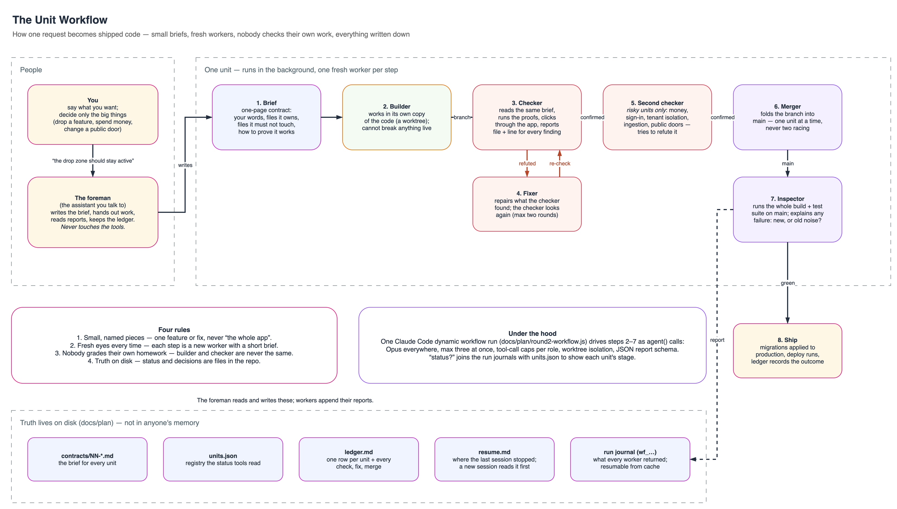
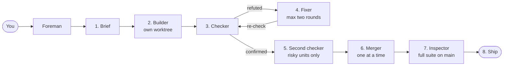

# unit-workflow

**Ship real software with a crew of AI workers you never have to babysit.**

[](LICENSE)
[](https://claude.com/claude-code)
[](skill/unit-workflow/SKILL.md#models-michael-2026-09-08-opus-everywhere)
[](examples/units.json)
[](#status)

unit-workflow is a way of running [Claude Code](https://claude.com/claude-code) on a large codebase where every piece of work is a small, written **unit**: one brief, one fresh worker in its own copy of the code, one independent checker, one merge, one full test pass, all in the background while you keep talking about the next thing. Nobody checks their own work, and everything is written down.

It was built while replacing a production SaaS platform end to end. In its first week it shipped **47 units** (features, fixes, migrations, an infrastructure cutover) with the founder reviewing outcomes, not diffs.



---

## Why this exists

Ask one AI assistant to build a whole product in one long conversation and four things go wrong. It forgets what it was told at the beginning. It reads half the codebase to find one file. Two changes made at once step on each other. And you can no longer tell what is *done* from what it *said* it did.

unit-workflow is four rules that fix those four problems:

| Rule | What it means in practice |
|---|---|
| **Small, named pieces** | A unit is one feature or one fix. Never "the whole app". |
| **Fresh eyes every time** | Every step is a brand-new worker reading a one-page brief, not the chat history. |
| **Nobody grades their own homework** | The worker that built it never checks it. Risky work gets a second, adversarial checker. |
| **Truth lives on disk** | Status, decisions, and results are files in the repo. A new session picks up exactly where the last one stopped. |

---

## The life of a unit

You say what you want. The foreman (the assistant you talk to) turns it into a unit and hands it to the crew.



1. **Brief.** A one-page contract: your words at the top, the files the unit owns, the files it must not touch, where to copy patterns from, and the commands that prove it is done.
2. **Builder.** Works in its own git worktree. It cannot break anything you or another unit is doing.
3. **Checker.** Reads the same brief, runs the proofs, clicks through the app, and reports file and line for every finding.
4. **Fixer.** Repairs what the checker found; the checker looks again. At most two rounds.
5. **Second checker.** Only for risky units (money, sign-in, tenant isolation, ingestion, public doors). Its brief is to *refute*.
6. **Merger.** Folds the branch into `main`, one unit at a time.
7. **Inspector.** Runs the whole build and test suite on `main` and explains every failure: new, or old noise?
8. **Ship.** Migrations applied, deploy runs, the ledger records the outcome.

Ask **"status?"** at any moment and get a table of every unit, its stage, and how long it has been there.

The plain-language walk-through, written for someone who has never touched AI tooling, is in [docs/how-it-works.md](docs/how-it-works.md).

---

## What it looks like

A contract (the brief a builder reads; nothing else):

```markdown
# Contract: Miles chat pane grip and resize

## Purpose
Michael 2026-09-10: "The AI chat pane needs a grip pill and the ability to resize it a little bit."

## Owns
- components/shell/chat-pane.tsx: a vertical grip pill on the inner edge; pointer-drag resize
  between 20rem and 40rem; keyboard arrows; double-click resets; width persisted in localStorage
  with the same hydration guard the file already uses.
- Do NOT edit: components/chat/*, components/try/*, lib/*.
- Tests: Vitest for the clamp/persist helpers; Playwright: drag, reload, width persists.

## Reference slice (copy from, do not explore further)
- components/shell/chat-pane.tsx:27-65 localStorage open flag; :160-200 width animation
- app/globals.css `--chat-pane-w`

## Acceptance test
pnpm typecheck; pnpm vitest run test/unit/shell* --reporter=dot; pnpm verify; Playwright as above.
```

The launch (one call; the script does the rest in the background):

```js
Workflow({
  scriptPath: 'docs/plan/round2-workflow.js',
  args: { units: [{ key: '79-chat-pane-resize', risky: false,
                    contract: 'docs/plan/contracts/79-chat-pane-resize.md',
                    brief: 'Grip pill and drag/keyboard resize for the chat pane, persisted.' }] }
})
```

The status table, ten minutes later:

```
RUNNING / QUEUED (1)
unit                  what                         stage                    calls elapsed run
79-chat-pane-resize   Miles chat pane grip/resize  verify1 (port=done)      14    9m      wf_db9122bf-366

LAST COMPLETED (3)
unit                  what                                 status  when              outcome
78-sandbox-v3         national-average card, revenue band  merged  2026-09-10T22:50  verified+merged
77-savings-estimate   savings range hero                   merged  2026-09-10T20:50  verified+merged; suite green
76-jobs-push-v2       respond-fast jobs, hourly fallback   merged  2026-09-10T18:20  verified+merged
```

Every worker's report is a fixed JSON shape, so the foreman reads fields, not paragraphs:

```json
{ "status": "done",
  "findings": [{ "path": "lib/sandbox/savings.ts", "line": 588,
                 "note": "spend basis had no document-status filter; now review OR approved" }],
  "changed": ["lib/sandbox/savings.ts", "components/try/savings-hero.tsx"],
  "verified": [{ "cmd": "pnpm typecheck", "pass": true },
               { "cmd": "pnpm vitest run test/unit/sandbox* --reporter=dot", "pass": true }],
  "ledgerUpdated": true, "blockers": [] }
```

---

## Quick start

You need Claude Code with the Workflow tool (dynamic workflows), a git repository, and a test command worth trusting.

1. **Install the skill.** Copy `skill/unit-workflow` to `~/.claude/skills/unit-workflow` (global) or `.claude/skills/unit-workflow` in the repo. Claude Code picks it up when you say "unit", "status?", or "launch X as a unit".
2. **Create the plan folder** in your repo:
   ```
   docs/plan/
     units.json          {"units":[]}
     ledger.md           one row per unit
     resume.md           where the last session stopped
     contracts/          one file per unit
     round2-workflow.js  copy of skill/unit-workflow/templates/unit-workflow.js, paths edited
   ```
3. **Edit two constants** at the top of `round2-workflow.js`: `PLAN` (the plan folder) and `TARGET` (the repo root). Adjust the acceptance commands in `SHARED` to your stack.
4. **Write the first contract** from `skill/unit-workflow/templates/contract.md`, register it in `units.json`, and say "launch it".
5. **Ask "status?"** whenever you like. Say "resume" in a new session and the foreman reads `resume.md` first.

Everything the foreman does is spelled out in [skill/unit-workflow/SKILL.md](skill/unit-workflow/SKILL.md).

---

## What is in this repository

| Path | What it is |
|---|---|
| [docs/how-it-works.md](docs/how-it-works.md) | The explainer, trunk first, details later. Start here if you are new. |
| [docs/rules.md](docs/rules.md) | Every rule the workflow runs on, with the incident that produced it. |
| [docs/diagrams/](docs/diagrams/) | The diagram above as editable draw.io, PNG, and the Python generator that draws it. |
| [skill/unit-workflow/](skill/unit-workflow/) | The Claude Code skill: SKILL.md, the workflow script template, the contract template, the status command. |
| [examples/contracts/](examples/contracts/) | Three real contracts from production units: a feature, a numbers-heavy estimate, an external integration. |
| [examples/units.json](examples/units.json) | A real registry slice showing the lifecycle fields. |

---

## Under the hood

The engine is a Claude Code **dynamic workflow**: a small JavaScript script that orchestrates many agents deterministically. `agent()` spawns a worker with a prompt, a model, a tool-call cap, worktree isolation, and a JSON schema its report must satisfy. `pipeline()` pushes each unit through build → check → fix → second check independently, so one unit can be merging while another is still being checked. Merges and the integration pass run after a barrier, one at a time. Every run has an id and a journal of what each agent returned; a stopped or edited run resumes from cache.

Models: every worker runs on Claude Opus, three at a time per run, with tool-call caps per role (roughly 60 to build, 30 to fix, 20 to check, 15 to merge). Read-only lookups may use Sonnet.

Cost: a feature-sized unit spends 400k to 1.1M tokens across its six to ten workers. That is the price of isolation and independent verification. It is cheaper than the long chat that rereads the codebase twice and still ships something half-checked.

---

## What it is not

- Not a framework or a library. It is a skill file, a script template, and a way of working. There is nothing to import.
- Not autonomous product management. The foreman decides routine things and stops for the owner on four kinds of decisions: dropping a feature, changing a public URL or API, spending money, touching an external service.
- Not tuned for tiny changes. A one-line fix goes to a single agent in a worktree, not a unit.

---

## Status

Private while it settles. The skill and script are lifted directly from a production project and still carry that project's defaults in a clearly marked section; generalizing them is the next step.

## License

[MIT](LICENSE)
